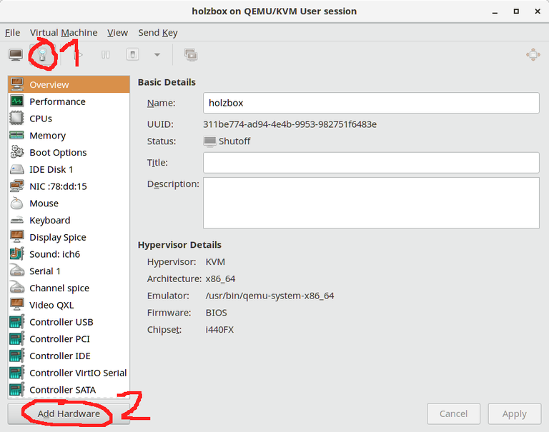
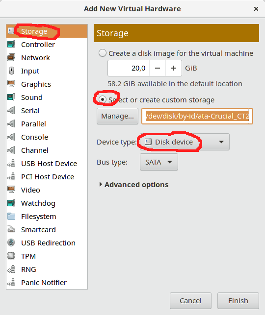

Linux宿主+Windows虚拟机使用物理显卡
===

这不是一个通用教程，这是我用了几年Virtualbox饱受经常性系统间复制黏贴失效，虚拟机性能低下之后，自己电脑尝试使用Qemu虚拟化操作的备忘录，文档记录和我的软件硬件有紧密联系，你要按自己实际情况调整。文档有参考 [github repository](https://github.com/xiyizi/kvm-config).

# 比windows宿主+Linux虚拟机好在哪
  
  - 可以切换多个不同windows版本, Linux 使用物理显卡
  - 方便对windows做镜像备份
  - 共享文件是以Linux为主,开发中可以做软链. 文件共享比samba共享效率高
  - 方便SSH连接宿主机

# 硬件要求

  - CPU要支持硬件虚拟化（为了使用 kvm）和 IOMMU（为了使用 VGA 直通）
  - 主板要支持IOMMU
  - 分给虚拟机的显卡要支持UEFI （正常2012年之后的显卡都可以)

# 环境清单

  - 宿主机系统: Archlinux 2023
  - 系统内核: 6.2.6
  - 主板: 华硕
  - 处理器: Intel(R) Core(TM) i7-7700 CPU @ 3.60GHz
  - 内存: 32 G

  - 集显: Intel Corporation HD Graphics 630
  - 独显: Nvidia GeForce RTX 2060

  - 显示器: 2个
  - 键盘： 2个
  - 鼠标： 1个

  - 虚拟机系统: Windows 10 64bit

# 开机按F2进入BIOS设置

  - 高级->cpu设置->Intel Virtualization Technology -> 开启
  - 高级->北桥->VT-d->开启
  - 高级->北桥->显示设置->首选显卡->Cpu Graphics
  - 启动->安全启动菜单->安全启动状态->关闭（如果是开启且不可点击看下一步）
  - 启动->安全启动菜单->密钥管理->清除安全启动密钥

# 安装宿主机系统

  - 制作启动U盘 
  - 使用 [小工具](https://github.com/keminar/linux-tools/tree/master/arch) 协助安装系统
  - 以下命令可验证虚拟化支持情况
  ```
  sudo egrep -o '(vmx|svm)' /proc/cpuinfo
  sudo lsmod | grep kvm
  sudo ls /dev/vfio/
  ```

# 宿主机启用IOMMU

  1. 编辑GRUB文件
  ```shell
  sudo vim /etc/default/grub
  ```
  2. 在GRUB_CMDLINE_LINUX_DEFAULT 这行加入核心参数启动IOMMU， 对于 Intel CPU(VT-d)，使用 intel_iommu=on iommu=pt， 对于 AMD CPU(AMD-Vi)，加 iommu=pt
  ```shell
  GRUB_CMDLINE_LINUX_DEFAULT="intel_iommu=on iommu=pt loglevel=3 quiet"
  ```
  3. 重新生成GRUB，并重启
  ```shell
  sudo grub-mkconfig -o /boot/grub/grub.cfg
  sudo reboot
  ```
  4. 使用如下命令之一验证是否生效
  ```shell
  sudo dmesg | grep -e "Directed I/O"
  sudo dmesg | grep -e DMAR -e IOMMU
  sudo cat /proc/cmdline | grep iommu
  ```

# 宿主机启用VFIO
  提示：这一步最开始会无法正常重启，排查是因为独显接了2显示器，同时又被禁用，修改为集显一个显示器，独显一个显示器，启动成功

  1. IOMMU开启以后执行下面的脚本
  ```shell
  #!/bin/bash
  shopt -s nullglob
  for d in /sys/kernel/iommu_groups/*/devices/*; do 
      n=${d#*/iommu_groups/*}; n=${n%%/*}
      printf 'IOMMU Group %s ' "$n"
      lspci -nns "${d##*/}"
  done;
  ```
  我的电脑含有独立显卡信息的一组输出
  ```
  IOMMU Group 2:
    00:01.0 PCI bridge [0604]: Intel Corporation 6th-10th Gen Core Processor PCIe Controller (x16) [8086:1901] (rev 05)
    01:00.0 VGA compatible controller [0300]: NVIDIA Corporation TU104 [GeForce RTX 2060] [10de:1e89] (rev a1)
    01:00.1 Audio device [0403]: NVIDIA Corporation TU104 HD Audio Controller [10de:10f8] (rev a1)
    01:00.2 USB controller [0c03]: NVIDIA Corporation TU104 USB 3.1 Host Controller [10de:1ad8] (rev a1)
    01:00.3 Serial bus controller [0c80]: NVIDIA Corporation TU104 USB Type-C UCSI Controller [10de:1ad9] (rev a1)
  ```
  有文章说要一整个组是直通的最小单位，所以将上面的设备ID **8086:1901,10de:1e89,10de:10f8,10de:1ad8,10de:1ad9** 加到 _/etc/default/grub_ ,修改后如下
  ```shell
  GRUB_CMDLINE_LINUX_DEFAULT="intel_iommu=on iommu=pt loglevel=3 quiet vfio-pci.ids=8086:1901,10de:1e89,10de:10f8,10de:1ad8,10de:1ad9"
  ```
  重新生成GRUB，并重启
  ```shell
  sudo grub-mkconfig -o /boot/grub/grub.cfg
  sudo reboot
  ```
  2. 提前加载vfio-pci模块
  修改 _/etc/mkinitcpio.conf_（从内核 6.2 版本开始，vfio_virqfd 的功能已经并入 vfio 模块，所以不用加）
  ```shell
  MODULES=(vfio_pci vfio vfio_iommu_type1)
  ```
  重新生成 initramfs 并重启
  ```
  sudo mkinitcpio -p linux
  sudo reboot
  ```
  3. 验证vfio-pci是否已经正确加载并绑定到正确的设备
  ```
  $ sudo dmesg | grep -i vfio
  [    1.074592] VFIO - User Level meta-driver version: 0.3
  [    1.085109] vfio_pci: add [8086:1901[ffffffff:ffffffff]] class 0x000000/00000000
  [    1.085182] vfio-pci 0000:01:00.0: vgaarb: changed VGA decodes: olddecodes=io+mem,decodes=none:owns=none
  [    1.085226] vfio_pci: add [10de:1e89[ffffffff:ffffffff]] class 0x000000/00000000
  [    1.085268] vfio_pci: add [10de:10f8[ffffffff:ffffffff]] class 0x000000/00000000
  [    1.085310] vfio_pci: add [10de:1ad8[ffffffff:ffffffff]] class 0x000000/00000000
  [    1.085349] vfio_pci: add [10de:1ad9[ffffffff:ffffffff]] class 0x000000/00000000
  ```
  也可以用lspci -nnk检查
  ```shell
  $ lspci -nnk -d 10de:1e89
  01:00.0 VGA compatible controller [0300]: NVIDIA Corporation TU104 [GeForce RTX 2060] [10de:1e89] (rev a1)
    Subsystem: ASUSTeK Computer Inc. Device [1043:8732]
    Kernel driver in use: vfio-pci
    Kernel modules: nouveau
  ```

# 安装qemu组件

  `````shell
  sudo pacman -S qemu libvirt edk2-ovmf virt-manager dnsmasq ebtables iptables bridge-utils gnu-netcat
  `````
  注： 安装iptables和ebtables会问是否要替换掉iptables-nft，y 确定

  把自己用户加到对应组，开虚拟机不需要输入密码
  ```shell
  sudo usermod -a -G libvirt $(whoami)
  sudo usermod -a -G kvm $(whoami)
  ```

  编辑 _/etc/libvirt/qemu.conf_ 将您的 OVMF 固件映像和运行时变量模板添加到 libvirt 配置
  ```shell
  nvram = [
	  "/usr/share/ovmf/x64/OVMF_CODE.fd:/usr/share/ovmf/x64/OVMF_VARS.fd"
  ]
  ```

  安装好后， 开始libvirtd服务，和自动启动nat网卡
  ```shell
  sudo systemctl enable --now libvirtd
  sudo virsh net-start default
  sudo virsh net-autostart default
  ```

# 创建虚拟机

  使用 **virt-manager** 配置虚拟机的大部分过程都无需指导，只要按照屏幕上的提示即可

  特别注意如下步骤:
  - 在虚拟机创建向导要求您命名虚拟机时（点击“完成”前的最后一步），勾选“在安装前自定义配置”
  - 在“概况”屏幕，将“固件”选为"UEFI"
  - 在“CPUs”屏幕，将CPU型号改为"host-passthrough"
  - 如果要最小化IO开销，请点击“添加硬件”，并在“控制器：中选择“SCSI”类型，型号为 "VirtIO SCSI"
   
    - Windows 不包含VirtIO驱动程序，所以你需要从[这里](https://fedorapeople.org/groups/virt/virtio-win/direct-downloads/stable-virtio/virtio-win.iso)下载包含驱动程序的 ISO 并且添加一个IDE CDROM（Windows 7之后可以使用SATA）并且连接到刚才的 ISO 。否则在安装过程中 Windows 无法识别 VirtIO 控制器。当 Windows 安装程序要求您选择要安装的磁盘时，加载 CD-ROM 下 visscsi 目录下的驱动程序。

  - 虚拟机在开始安装时您还可能会直接进入UEFI菜单，是因为虚拟机在启动的时候可能并未检测到正确的ISO文件，您需要手动指定引导顺序。输入“exit”并选择“boot manager”，您将会进入一个选择引导设备的菜单。
  - 至少为宿主机留下一个鼠标和/或键盘，防止客户机出现问题的时候无法操作宿主机
  - 刚装好的系统-设备管理器里会有2个没有驱动,安装virtio-win后即可正常

# 虚拟机优化

  安装完系统后关闭虚拟机,备份当前配置先运行
  ```shell
  sudo virsh dumpxml win10 > ~/win10-dump.xml
  ```

  开始优化配置
  ```shell
  sudo virsh edit win10
  ```

  第一步，第一行内容默认应该是这样的
  ```xml
  <domain type='kvm'>
  ```
  修改为
  ```xml
  <domain type='kvm' xmlns:qemu='http://libvirt.org/schemas/domain/qemu/1.0'>
  ```

  把 features 括号内的内容修改为:
  ```xml
  <features>
    <acpi/>
    <apic/>
    <hyperv>
      <relaxed state="on"/>
      <vapic state="on"/>
      <spinlocks state="on" retries="8191"/>
      <vendor_id state="on" value="1234567890ab"/>
    </hyperv>
    <kvm>
      <hidden state="on"/>
    </kvm>
    <vmport state="off"/>
    <ioapic driver="kvm"/>
  </features>
  ```

  CPU核心固定, 要查看 CPU 拓扑，运行 `lscpu -e`：
  ```shell
  $ lscpu -e
  CPU NODE SOCKET CORE L1d:L1i:L2:L3 ONLINE    MAXMHZ   MINMHZ       MHZ
  0    0      0    0 0:0:0:0           是 4200.0000 800.0000 1400.0200
  1    0      0    1 1:1:1:0           是 4200.0000 800.0000 1399.9969
  2    0      0    2 2:2:2:0           是 4200.0000 800.0000 1400.0570
  3    0      0    3 3:3:3:0           是 4200.0000 800.0000 1400.1080
  4    0      0    0 0:0:0:0           是 4200.0000 800.0000 1399.9950
  5    0      0    1 1:1:1:0           是 4200.0000 800.0000 1400.0160
  6    0      0    2 2:2:2:0           是 4200.0000 800.0000 1400.0900
  7    0      0    3 3:3:3:0           是 4200.0000 800.0000 1400.0850
  ```
  修改CPU配置， 先找到 `<vcpu>`，修改：

  ```xml
  <vcpu placement='static'>4</vcpu>
  <cputune>
    <vcpupin vcpu='0' cpuset='2'/>
    <vcpupin vcpu='1' cpuset='6'/>
    <vcpupin vcpu='2' cpuset='3'/>
    <vcpupin vcpu='3' cpuset='7'/>
    <emulatorpin cpuset='0,4'/>
  </cputune>
  ```

  找到 `<CPU>` 调整为如下内容:
  ```xml
  <cpu mode='host-passthrough' check='none'>
    <topology sockets='1' cores='2' threads='2'/>
    <cache level='3' mode='emulate'/>
  </cpu>
  ```

## 改进 AMD CPUs 性能

  从 QEMU 3.1 开始 TOPOEXT cpuid flag 默认被禁用. 为了在AMD CPU上使用 hyperthreading(SMT) 需要手动开启:

  ```xml
  <cpu mode='host-passthrough' check='none'>
    <topology sockets='1' cores='2' threads='2'/>
    <cache level='3' mode='emulate'/>
    <feature policy='require' name='topoext'/>
  </cpu>
  ```

  注： 因为我不是AMD的cpu所以没有操作，上面只是一段引用

# 内存大分页
  目前还没有配置,请参考官网, 略

# 文件夹共享
  virtiofs文件系统实现了一个半虚拟化的virtio-fs设备驱动,可以实现主机<->虚拟机文件共享,可以在虚拟机挂载**一个**主机目录

  优点:
  - 不经过网卡,速度更好
  - 百度云可直接下载到共享目录(百度云是不能直接下载到samba挂载目录的)

  缺点: 我测试的只能添加一个共享文件夹,且盘符为Z

  虚拟机xml添加配置, 和`<memory>`同级缩进
  ```shell
  <memoryBacking>
    <source type='memfd'/>
    <access mode='shared'/>
  </memoryBacking>
  ```

  virt-manager 打开虚拟机-添加设备-共享文件夹

  启动windows虚拟机,安装[winfsp](https://winfsp.dev/rel/),全部默认下一步即可

  win+r打开运行,输入services.msc 在服务中,把 VirtIO-FS Service启动并设置成自动启动

  如果设备管理器中是否有大容量存储设备没有驱动,使用virtio-win驱动安装, 如果还没有共享文件,重启下虚拟机

# 添加物理硬盘

  查看硬盘的设备路径
  ```shell
  $ ls -l /dev/disk/by-id/
  insgesamt 0
  lrwxrwxrwx 1 root root 9 23. Jul 21:05 ata-Crucial_CT256MX100SSD1_14360D295569 -> ../../sda
  lrwxrwxrwx 1 root root 10 23. Jul 21:05 ata-Crucial_CT256MX100SSD1_14360D295569-part1 -> ../../sda1
  lrwxrwxrwx 1 root root 10 23. Jul 21:05 ata-Crucial_CT256MX100SSD1_14360D295569-part2 -> ../../sda2
  ```

  virt-manager 打开虚拟机- 添加设备-存储
  

  选择自定义存储, 路径里输入设备路径,如 **/dev/disk/by-id/ata-Crucial_CT256MX100SSD1_14360D295569-part1**
  
  设备类型选择**Disk device**, Bus type 选择 **SATA** 
  
  

  启动虚拟机,进行磁盘管理, 格式化并挂载

# 使用barrier 共享鼠标键盘
  
  推荐把Windows做为服务端, Linux做为客户端. 因为Windows经常会弹确认框时鼠标失焦, 另外Windows作为虚拟机桥接地址做服务更安全, 但是Windows默认开了防火墙，记得打开 24800 端口，这是 barrier 默认监听端口. 需要注意的是鼠标只能从服务端共享给客户端,所以鼠标键盘需要直通给虚拟机,再共享回宿主机. 

  1. Linux 安装
  ```shell 
  sudo pacman -S barrier
  ```
  设置去掉SSL选项， 主页面选择客户端填写要连接的windows机器IP并启动

  2. Windows 直接去 [release](https://github.com/debauchee/barrier/releases) 页面 下载最新版本安装即可。安装后在设置去掉SSL启动, 这样就不需要生成证书。选择“服务端” 点击 “设置服务器”， 点击弹窗中的右上角的图标，加一个显示器，名字就命名为Linux 机器的 “屏幕名”，然后在方格中摆好位置确定, 启动服务。

  3. linux 客户端自启动
  编辑 _~/.config/systemd/user/barrierc.service_

  ```
  [Unit]
  Description=Barrier keyboard & mouse sharing software (Server)
  After=network.target

  [Service]
  PassEnvironment=DISPLAY
  ExecStart=/usr/bin/barrierc -f --debug INFO --name bogon --disable-crypto --no-restart [192.168.122.22]:24800
  Type=simple
  ProtectHome=read-only
  ProtectSystem=true
  PrivateTmp=true
  Restart=always
  RestartSec=10

  [Install]
  WantedBy=default.target
  ```
  然后执行
  ```
  systemctl --user enable barriers.service
  ```
  4. Windows 自启动
  自启动是启动的系统服务。可以Win+R打开services.msc找到Barrier看是否是自动启动，检查当前状态。如果正常启动 **任务管理器-详细信息** 里能找到两个进程 barrierd.exe 和 barriers.exe ,如果显示启动但是没有barriers.exe就可能是和barrier.exe图形设置冲突了。需要以管理员身份打开barrier软件，然后菜单中点击设置， 不要勾选 “Minimize to System Tray”，“Hide on startup”， “Start Barrier on startup” 点击确定，并重启服务
  
  注: 如果不能使用的话，点击菜单中的 “显示日志”，来查看为啥不能用。


# Evdev 共享鼠标键盘 Mouse, Keyboard  

  Input is often the first hurdle presented after getting a passthrough VM up and running. Without Spice or VNC, users often resort to hacks and workarounds to control their virtual machine. Passing through USB devices via evdev has become a popular if badly documented way of handling input. The advantage of evdev is that it has very low latency and overhead. The downside is that it becomes frustrating to switch between the host and guest.

  While a physical KVM switch will always be a viable option, complete solutions with modern video connectors can be very expensive, and start to eat into a build budget when compounded with other hardware quality of life improvements. Evdev passhthrough is a good alternative for those  that can’t afford hardware solutions but still want low latency and accurate input.

## What is Evdev?

  Evdev is an input interface built into the Linux kernel. QEMU’s evdev passthrough support allows a user to redirect evdev events to a guest. These events can include mouse movements and key presses. By hitting both Ctrl keys at the same time, QEMU can toggle the input recipient. QEMU’s evdev passthrough also features almost no latency, making it perfect for gaming. The main downside to evdev passthrough is the lack of button rebinding – and in some cases, macro keys won’t even work at all.

  This setup has no requirements besides a keyboard, mouse, and working passthrough setup. This guide assumes you have already configured these.

## Configuring Evdev

  To start, you will need to find the input device IDs for your mouse and keyboard. This can get a little finicky, as some keyboard manufacturers do this differently. The Linux kernel exposes two different locations for evdev devices: `/dev/input`, and `/dev/input/by-id`. `/dev/input/by-id` is generally preferred, as you can pass through input devices without worrying about the file path changing if you plug/unplug additional devices. List the contents of this directory:

  ```shell
  ls /dev/input/by-id
  ```

  It will contain your input devices. Take note of which ones you want to pass through. Be careful here, as I have noticed two common discrepancies. The first is an “if01” or “if02” or similar near the end of an input device name. The best method to find out which one is correct is to use “cat.” Run:

  ```shell
  cat /dev/input/by-id/[input device id]
  ```

  Press random keys on the keyboard you want to pass through. If garbled characters appear on-screen, you have selected the correct one. If not, try another until you find the correct one. Use Ctrl+C to cancel the “cat” process. Another issue to be wary of is the input device type. A lot of mice will have keyboard inputs, and some keyboards even have mouse inputs. Select the input device that corresponds to your device. For example, if you see two entries for your keyboard, with one ending with “event-kbd”  and the other ending with “event-mouse,” you will generally want to pick “event-kbd.” Some hardware manufacturers hate following standards, though, and you might find yourself needing to switch this up.

  Now that you’ve noted the devices you want to use evdev with, it’s time to enable it in your libvirt XML. Open the XML with the following, replacing “nano” with your editor of choice, and “win10” with the name of your libvirt domain:

  `nano virsh edit win10`

  Make sure the first line looks like this:  

  ```shell
  <domain type='kvm' id='1' xmlns:qemu='http://libvirt.org/schemas/domain/qemu/1.0'>
  ```

  If it doesn’t, replace the first line with that. Next, add the following near the bottom, directly above `</domain>`:

  ```shell
  <qemu:commandline>
    <qemu:arg value='-object'/>
    <qemu:arg value='input-linux,id=mouse1,evdev=/dev/input/by-id/MOUSE_NAME'/>
    <qemu:arg value='-object'/>
    <qemu:arg value='input-linux,id=kbd1,evdev=/dev/input/by-id/KEYBOARD_NAME,grab_all=on,repeat=on'/>
  </qemu:commandline>
  ```

  If you already have qemu:commandline set up for whatever reason, add the qemu:arg options above to that section. Don’t add another set of qemu:commandline arguments. Replace the `MOUSE_NAME` and `KEYBOARD_NAME` parts with the id of your input devices. Next, save the XML. In nano, you can do this with Ctrl+X, then Y, then Enter. Boot up your VM. It should now work, with the keyboard and mouse being directly passed to the VM! By hitting **both Ctrl keys at the same time**, you can switch between hosts. Wonderful, isn’t it?

  I had to use the following block in my win10 xml to get things working:  

  ```xml
  <qemu:commandline>
    <qemu:arg value='-object'/>
    <qemu:arg value='input-linux,id=mouse1,evdev=/dev/input/by-id/usb-MOSART_Semi._2.4G_Keyboard_Mouse-if01-event-mouse'/>
    <qemu:arg value='-object'/>
    <qemu:arg value='input-linux,id=kbd1,evdev=/dev/input/by-id/usb-Logitech_USB_Receiver-event-kbd,grab_all=on,repeat=on'/>
  </qemu:commandline>
  ```

## 故障
### Evdev Permission Errors

There are a wide variety of causes for permission issues with evdev passthrough. To start, let’s set up cgroup_device_acl in libvirt’s configuration. Ensure the following is in `/etc/libvirt/qemu.conf`, of course replacing `KEYBOARD_NAME` and `MOUSE_NAME`:

```shell
cgroup_device_acl = [
        "/dev/null", "/dev/full", "/dev/zero", 
        "/dev/random", "/dev/urandom",
        "/dev/ptmx", "/dev/kvm", "/dev/kqemu",
        "/dev/rtc","/dev/hpet",
        "/dev/input/by-id/KEYBOARD_NAME",
        "/dev/input/by-id/MOUSE_NAME"
]
```

Now restart libvirtd with  

```shell
systemctl restart libvirtd
```

for OpenRC distributions like Gentoo and Artix.
If this still throws a permission error, the likely cause is that qemu is running as a user that does not have access to the input devices for security reasons. There are a few ways to get around this by changing the user that libvirt spawns the qemu process as (note that this will most likely break any PulseAudio passthrough you may have done, if you already updated this to your user):

```shell
user = "root"
group = "root"
```

This method is a bit overkill, as it effectively removes all sandboxing that libvirt applies by running the user as a non-root user by default. If you don’t use pulseaudio, and you still want sandboxing, then follow the instructions here:
First, create a new user/group to sandbox as, for example “evdev”:

```shell
useradd -s /usr/sbin/nologin -r -M -d /dev/null evdev
groupadd evdev
usermod -a -G input evdev
```

With that done, you’ve now created a user that has no home directory that can’t normally be logged into from a login shell, and added the new user to the input group that is necessary to read the files for evdev. Following this, update the qemu.conf to reflect these changes:

```shell
user = "evdev"
group = "evdev"
```

Finally, if you do require PulseAudio, all you need to do is add your user to the input group (Assuming that you already have PulseAudio working properly.)

```shell
gpasswd -a <your user> input
```

If this still throws a permission error, set the following in the same file:

```shell
clear_emulator_capabilities = 0
```

If this still throws a permission error, execute the ollowing command:  

```shell
chown root:kvm /dev/kvm
```

If this still throws a permission error, execute the ollowing command:  

Add the folowing to `/etc/apparmor.d/abstractions/libvirt-qemu`

```shell
/dev/input/* rw,
```

Then restart apparmor:  
`sudo service apparmor restart`  

Any permission issues should now be solved.

My settings in `/etc/libvirt/qemu.conf` for my setup are the following:

```shell
user = "root"
group = "root"
clear_emulator_capabilities = 0

cgroup_device_acl = [
    "/dev/null", "/dev/full", "/dev/zero",
    "/dev/random", "/dev/urandom",
    "/dev/ptmx", "/dev/kvm", "/dev/kqemu",
    "/dev/rtc","/dev/hpet",
    "/dev/input/by-id/usb-Logitech_USB_Receiver-event-kbd",
    "/dev/input/by-id/usb-MOSART_Semi._2.4G_Keyboard_Mouse-if01-event-mouse"
]
```


# 参考链接
  https://github.com/xiyizi/kvm-config 

  https://ckirbach.wordpress.com/2017/07/25/how-to-add-a-physical-device-or-physical-partition-as-virtual-hard-disk-under-virt-manager/

  https://mathiashueber.com/cpu-pinning-on-amd-ryzen/#Virtual-machine-CPU-configuration

  https://heiko-sieger.info/running-windows-10-on-linux-using-kvm-with-vga-passthrough/#Two_graphics_processors

  https://wiki.archlinux.org/index.php/PCI_passthrough_via_OVMF#CPU_pinning

  https://mathiashueber.com/configuring-hugepages-use-virtual-machine/

  https://passthroughpo.st/using-evdev-passthrough-seamless-vm-input/

  https://bbs.archlinux.org/viewtopic.php?id=69454

  https://python-evdev.readthedocs.io/en/latest/tutorial.html

  https://github.com/jedisct1/piknik

  https://wiki.archlinuxcn.org/wiki/PCI_passthrough_via_OVMF

  https://documentation.suse.com/zh-cn/sles/15-SP3/html/SLES-all/app-gpu-passthru.html

  https://liucreator.gitlab.io/zh/posts/0x0b-single-gpu-passthrough/main/

  https://ivonblog.com/posts/archlinux-gpu-passthrough/

  https://ivonblog.com/posts/archlinux-qemu-virt-manager/

  https://blog.51cto.com/u_14204744/5418824

  https://www.bilibili.com/video/BV1k341127oh/

  http://www.bryh.cn/a/22000.html

  https://lantian.pub/article/modify-computer/laptop-intel-nvidia-optimus-passthrough.lantian/

  https://www.jianshu.com/p/e258562d04dd

  https://www.doowzs.com/posts/2021/04/rtx-vfio-passthrough/

  https://github.com/k-spit/gpu-passthrough

 
  https://www.codeplayer.org/Blog/%E5%8F%8C%E6%98%BE%E5%8D%A1%E7%AC%94%E8%AE%B0%E6%9C%AC%E7%8B%AC%E6%98%BE%E7%9B%B4%E9%80%9A.html

  http://www.360doc.com/content/23/0118/17/4703094_1064119167.shtml

  https://jiajunhuang.com/articles/2021_11_26-use_barrier.md.html

  https://wiki.archlinux.org/title/PCI_passthrough_via_OVMF#Passing_keyboard/mouse_via_Evdev

  https://passthroughpo.st/using-evdev-passthrough-seamless-vm-input/
